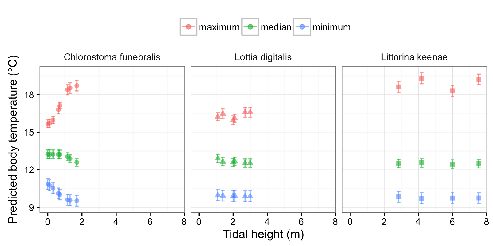

```{r setup, include = FALSE, cache = FALSE}
knitr::opts_chunk$set(echo = FALSE, message = FALSE, warning = FALSE, 
                      fig.path = 'figs/', cache.path = 'cache/graphics-', 
                      fig.align = 'center', fig.width = 5, fig.height = 5, 
                      fig.show = 'hold', cache = TRUE, par = TRUE)
knitr::opts_knit$set(root.dir = "../../")
```

```{r r_packages}
# tidyverse
library(dplyr); library(ggplot2); library(tidyr); library(readr)
theme_set(theme_bw(base_size = 12))

library(knitr)

```

# Introduction {-}

In this study we used a comparative-historical approach to test the hypothesis that reductions in body size, consistent with climate warming, have occurred over a period of 5–7 decades. Moreover, we examined the consistency of change across a suite of species that span a range of environmental variability. Specifically, we examine changes in the size-frequency distributions of three gastropods inhabiting a gradient of thermal stress in the rocky intertidal between 1947-1963 and 2014-2015.

### Predictions {-}

1. Snail size is inversely related to temperature. That is, we expected size declines over time, assuming sea and/or air temperatures have increased during same period [@Barry1995]. We expected the opposite pattern if temperatures have decreased, or no pattern if temperatures have not changed. 
    a. Prediction: snails are smaller now than 50 years ago
    b. Test: Size ~ Era

2. Change in snail size is mediated by tidal height. Climate warming is expected to be manifested as increases in temperature variability, as well as increases in mean temperature. Temperature variability typically increases with tidal height. 
    a. Prediction: An increase in extreme temperatures in the higher intertidal selects for larger individuals because larger snails are less susceptible to dessication mortality [@Gardner2011]
    b. Alternative: Temporal reductions in body size coincide with the areas of greatest warming (e.g., due to metabolic effects of warming without a compensatory increase in consumption)
    c. Test 1: Size ~ Era x Species x Tidal height 
    d. Test 2: Temperature ~ Species x Tidal height (tests the assumption that temperature increases with tidal height, and that this response is consistent across species)

# Methods {-}

To test the hypothesis that consistent shifts in animal body size occurred over decadal time-scales, we studied three species of intertidal gastropods (*Chlorostoma funebralis*, *Lottia digitalis*, *Littorina keenae*) at Hopkins Marine Station, Pacific Grove, CA, USA. We chose these species because (1) historical size-frequency data were available, (2) they comprise a single phylogenetic and functional group (grazing gastropods), and (3) the benthic intertidal community at Hopkins Marine Station has exhibited a fingerprint of change consistent with climate warming [@Barry1995]. Moreover, these three species span a gradient of thermal stress in the rocky intertidal zone, permitting a preliminary investigation of the hypothesis that environmental variability influences temperature-size shifts [@Gardner2011]. We quantified the thermal variability experienced by each species in the sampling areas using a short-term (8 weeks) deployment of temperature loggers. The historical shifts in body size were interpreted in the context of long-term (50 years) environmental records.

# Results

### Decadal-scale changes in snail body size

We used a linear mixed-effects model (nlme package) to test the hypothesis that snail size frequency distributions differed between era (past vs present), and that this variation was mediated by tidal height. We treated sampling areas as random intercepts in the model. 

```{r aic1, echo = FALSE, eval = TRUE}
aic1 <- read.csv("output/AIC_eraXspeciesXtidalht.csv") %>% 
  select(-c(X, AIC, LL)) 
kable(aic1, caption = "Model selection results for linear mixed effects models testing the fixed effects of era, species, and tidal height on snail body size")
```

The model selection results suggest a strong interaction between all three predictors. In general, the peaks of the size frequency distributions have shifted to the left for all three species (Fig. 1), and thus mean snail body size is xx% smaller now than it was xx years ago. 


However, the 3-way interaction appears to be driven by increases in the maximum size of *L. keenae*. We can inspect this further by plotting the mean snail size as a function of era and tidal height (Fig. 2). 


The temporal increase in size for *L. keenae* was consistent with the prediction that extreme warm temperatures select for larger snails. Notably, all of the snails at the highest intertidal location were concentrated in a single crevice, suggesting that abiotic conditions (e.g., temperature, wind, dessication risk) were considerably more stressful on the exposed face in this zone (zone D). 


### Short-term intertidal temperature measurements

To test the assumption that temperature means and variability increased with tidal height, we deployed temperature loggers in locations that spanned the tidal range of each sampling area. For *L. keenae*, we placed a logger each in a crevice and the exposed face for each sampling area (A-D; Fig. 3). 


In general, habitat temperature increased with tidal height, except for the two highest zones for *L. keenae* (Fig. 4). We hypothesize that these higher zones displayed lower than expected temperatures because:

1. The lower projected area results in lower radiative heating of the rock
2. The white projected area, due to bird guano, results in reflection of solar radiation
3. The high elevation, relative to the surrounding intertidal habitat, facilitates cooling through evaporation due to boundary layer effects

In summary, we can reject the hypothesis that body size increase observed in the highest intertidal site was due to exceptionally warm temperatures. We can provide a spatial test of this hypothesis by using the present day dataset, which was sampled with greater spatial resolution (i.e., larger numbers of replicates per sampling area). Each replicate (n = 90) was assigned to the nearest temperature logger (n = 17) with the most similar tidal height. We used another linear mixed effects model to test the effects of mean temperature (daily maximum, daily median, daily minimum) on body size. Sampling units were treated as random intercepts in the model. 


Snail body size correlated negatively with daily maximum temperature (Fig. 5), mirroring the temporal pattern of body size reduction. Body size did not correlate strongly with daily median temperatures (except for *C. funebralis*), but was correlated positively with daily minimum temperature. Together, these results suggest that body size is maximized at intermediate temperatures, at least for *C. funebralis* and *L. keenae*. Indeed, a quadratic regression better fit the relationship between size and median temperature (Fig. 6). Therefore, one mechanism for the observed increases in Littorina body size in the higher intertidal zones (but relatively cool temperatures) may be due to beneficial increases in temperature over the past six decades. 


### 13-year hindcasts of limpet body temperature

To provide a longer thermal context for the short-term temperature measurements, we used a heat budget model to hindcast the body temperatures of a limpet (*Lottia gigantea*) from August 1 1999 to July 31 2013. The model estimated a limpet body temperature every 10 minutes for each of the intertidal locations we deployed temperature loggers. 

With regard to the model parameters, the following settings were used:

- A brown-shelled *L. gigantea* was modeled. The shell length of the snail is 35.4 mm. 

- We measured the orientation of the substratum (compass direction and slope above horizontal) for each logger position, each with an associated shore height

- The model was run with 0 wave swash (worst case scenario, leading to
hotter temperature due to less wave splash), so that a given shore height would
only be submerged when the tide + significant wave height summed up to a value 
above the given shore level

- The model likely overpredicts body temperature for the three species in our study because:
    1. The model limpet (*L. gigantea*) was larger than the limpet in our study (*L. digitalis*), and larger than the other two snails
    2. The surface area of the attachment point of limpets (i.e., the foot) is relatively larger than the feet of *C. funebralis* and *L. keenae*, and thus conductive heat transfer is lower for these latter species
    3. *L. keenae* can reduce its body temperature by glueing itself to the substratum and retracting its foot [Miller reference]
    4. *C. funebralis* often lives within algal turfs which provide shade and moisture

We summarised the model output (predicted temperature at 10-minute intervals) as follows:

1. Get daily maximum, median, and minimum
2. For each month, calculate the mean daily maximum, median, minimum
3. For each year, retrieve the maximum monthly mean, median monthly mean, and minimum monthly mean

The hindcast results were surprising because maximum body temperatures increased with shore height only for *C. funebralis* (Figure 7). These snails live on horizonal substrata, which heat up faster than nearby vertical surfaces (which harbored the other two species in our study). Moreover, the predicted temperatures were lower than the observed temperatures (Figure 4). 



These particular microsites are generally either low on the shore, or on
north or northwest-facing rocks that recieve very little direct sunlight. The
overall hottest site only reached a maximum temperature of 25.5 C, even
though it was 7.55 m above MLLW. That site faces southwest, so it would
primarily get sun in the later afternoon, rarely the hottest time of day at HMS.

### Long-term temperature trends

Our results are consistent with the 'third universal prediction' of body size decline with climate warming if maximum habitat temperatures have increased during the course of our study. Of course, we do not have long-term temperature records for the sampling areas in the study. Instead, we will examine long-term temperature records of sea surface temperatures collected daily at Hopkins Marine Station, and records of air temperature from an inland weather station. 

#### Sea surface temperature

We tested for temperature trends using regression with correlated errors. Only maximum temperature displayed a positive trend over time for each species (Table 2, Fig. 8). Annual median and minimum temperatures did not change over time. 

```{r gls_temp, echo = FALSE, eval = TRUE}
gls_temp <- read.csv("output/gls_annual_summary2.csv") %>% select(-X)

kable(gls_temp, caption = "Summary of linear regressions testing surface seawater temperature trends for each species")
```


```{r size_change_temporal, echo = FALSE, eval = TRUE}
size_change <- read.csv("output/size_change_datSubW2.csv") %>% select(-X)
size_change2 <- size_change %>% 
  select(species, site, sampleArea, delta_mean:delta_95_per)

size_changeL <- size_change2 %>% gather(key = delta_x, value = delta_value, 
                                        delta_mean:delta_95_per)

gls_temp2 <- gls_temp %>% filter(metric == "max_C") %>% select(species, change_temp_C)

size_changeL2 <- inner_join(size_changeL, gls_temp2, by = "species") %>%
  mutate(delta_value_perC = delta_value/change_temp_C)

size_change_means <- size_changeL2 %>%
  group_by(species, delta_x) %>% 
  summarise(mean = mean(delta_value_perC), 
            sd = sd(delta_value_perC),
            n = n(), 
            se = sd/sqrt(n), 
            CI = qt(0.975, df = n - 1) * se) %>% 
  ungroup()

```

```{r size_change_spatial}

scs <- read.csv("output/size_change_max_temp_summary2.csv") %>% select(-X)

sct <- size_change_means %>% filter(delta_x == "delta_med") %>% 
  select(species, mean, se) %>% 
  rename(mmPerC = mean, 
         mmPerC_se = se) %>%
  mutate(estimate = "temporal")

scs <- scs %>% select(species, value:std_error) %>% 
  rename(mmPerC = value, 
         mmPerC_se = std_error) %>%
  mutate(estimate = "spatial")

size_change_comparison <- rbind(sct, scs)

# Reorder levels
size_change_comparison$species <- factor(size_change_comparison$species, 
                                         levels = rev(c("Littorina keenae",
                                           "Lottia digitalis", 
                                           "Chlorostoma funebralis")))

```

```{r plot_size_change_comparison}
theme_set(theme_bw(base_size = 12))

# size_change_comparison %>%
#   ggplot(aes(species, mmPerC, color = species, shape = species)) + 
#   geom_point() + 
#   geom_errorbar(aes(ymax = mmPerC + mmPerC_se, 
#                     ymin = mmPerC - mmPerC_se), width = 0.1) + 
#   facet_wrap(~ estimate) + 
#   theme(legend.title = element_blank()) + 
#   ylab(expression(paste("Size change (mm per ", degree, "C)"))) + 
#   xlab("") + 
#   theme(axis.title.x=element_blank(),
#         axis.text.x=element_blank(),
#         axis.ticks.x=element_blank()) + 
#   theme(strip.background = element_blank()) + 
#   theme(legend.position = "top") + 
#   geom_hline(yintercept = 0, linetype = "dashed", color = "gray70")

# Figure 9. Spatial and temporal estimates of size change per degree C. Spatial estimates were based on mixed effects models for each species (size ~ mean daily maximum temperature). Temporal estimates were estimated as change in median size between eras (for each sampling area), divided by change in temperature estimated from the linear regression between maximum temperatures (Fig. 8). 

```

#### Air temperature
To provide an aerial temperature context for these intertidal snails,  we retrieved long-term air temperature records from  [NCDC station # 5795, Monterey](http://169.237.140.1/calludt.cgi/WXDESCRIPTION?MAP=&STN=MONTEREY.C#001). Although these data are several (xx) km inland from the rocky intertidal study sites in Pacific Grove, these are the best available time-series to our knowledge. 

The data available were daily maximum, minimum, and observed temperature at a given time. We analyzed it similarly to the HMS seawater data. Briefly, we calculated the monthly median values of daily maximum, minimum, and observed values. These monthly values were then averaged, and used in regression analyses (accounting for temporal autocorrelation, as above). 

```{r gls_weather, echo = FALSE, eval = TRUE}
gls_weather <- read.csv("output/weather_annual_summary2.csv") %>% select(-X) %>% 
  slice(1:3)

kable(gls_weather, caption = "Summary of linear regressions testing air temperature trends in Monterey, California")
```

The only significant temporal trends were for daily maximum temperatures, which actually decreased over time (Fig. 9). 


# Conclusions

Our results support the 'third universal prediction' that climate warming is associated with body size declines in intertidal snails. Sampling areas lowest in the intertidal were associated with the largest declines in body size, and the sign of body size change reversed for *L. keenae* in the highest intertidal area. 

Our results suggest a temperature-related hypothesis for the variation in body size change along the thermal gradient. Long-term seawater warming (maximum temperatures) but aerial cooling (maximum temperatures) was observed in the region. Therefore, the observed declines in body size in the low intertidal but observed increases in body size in the high intertidal were consistent with the temperature-size rule (i.e., 'hotter is smaller'). 

Of course, we will have to list alternative hypotheses because our results are necessarily observational. 

### Next steps

1. Correlate Hopkins weather station data to the Monterey weather data?
    - I have the weather station data from Chris Patton, but I should probably use the air temperatures that went into the heat budget models
2. Estimate duration of time that each tidal height is submerged?
3. Include density of snails as covariate in models?


