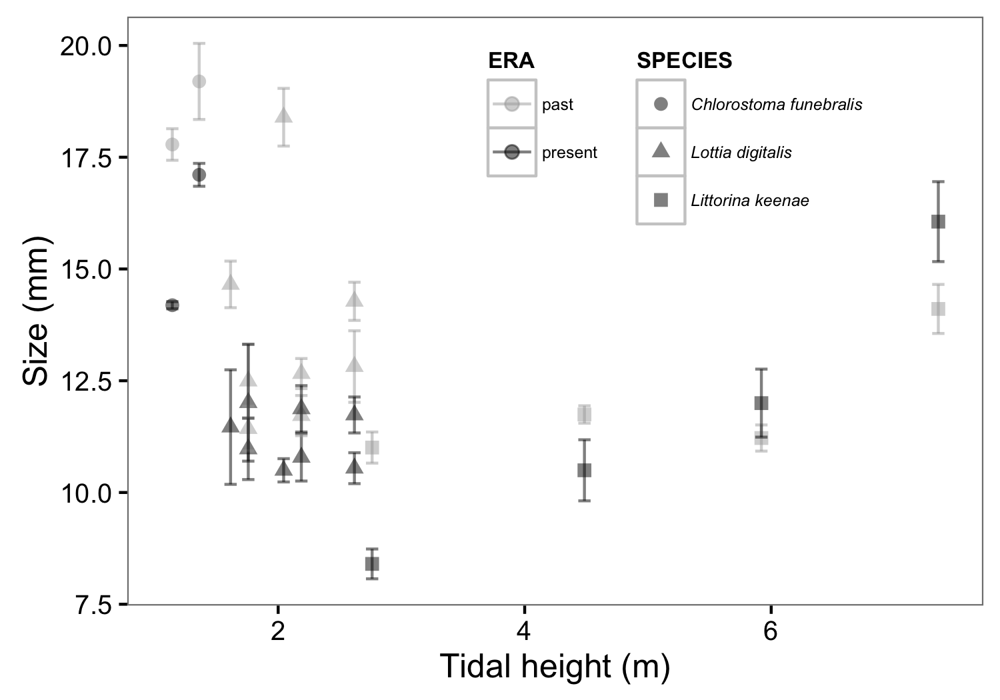
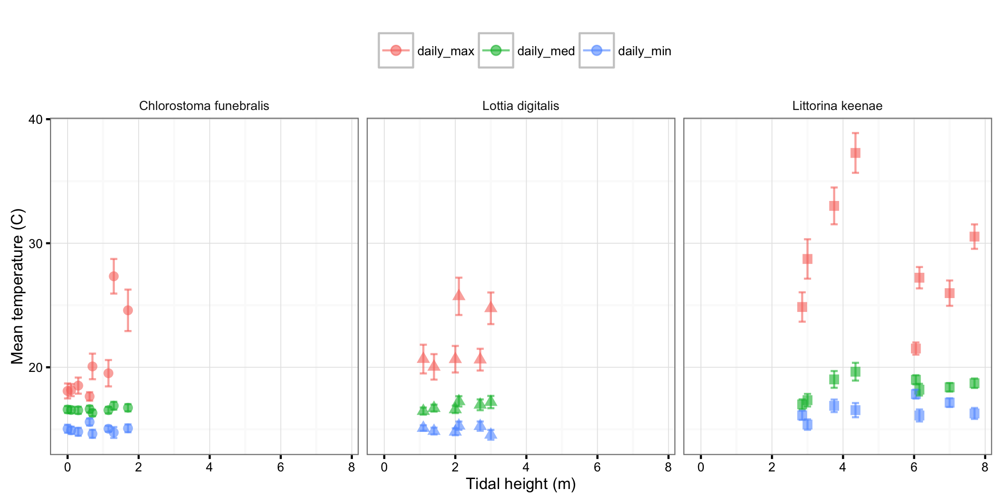

```{r setup, include = FALSE, cache = FALSE}
knitr::opts_chunk$set(echo = FALSE, message = FALSE, warning = FALSE, 
                      fig.path = 'figs/', cache.path = 'cache/graphics-', 
                      fig.align = 'center', fig.width = 5, fig.height = 5, 
                      fig.show = 'hold', cache = TRUE, par = TRUE)
knitr::opts_knit$set(root.dir = "../../")
```

```{r r_packages}
library(knitr)
library(dplyr)
```


# Introduction {-}

In this study we used a comparative-historical approach to test the hypothesis that reductions in body size, consistent with climate warming, have occurred over a period of 5–7 decades. Moreover, we examined the consistency of change across a suite of species that span a range of environmental variability. Specifically, we examine changes in the size-frequency distributions of three gastropods inhabiting a gradient of thermal stress in the rocky intertidal between 1947-1963 and 2014-2015.

# Methods {-}

To test the hypothesis that consistent shifts in animal body size occurred over decadal time-scales, we studied three species of intertidal gastropods (*Chlorostoma funebralis*, *Lottia digitalis*, *Littorina keenae*) at Hopkins Marine Station, Pacific Grove, CA, USA. We chose these species because (1) historical size-frequency data were available, (2) they comprise a single phylogenetic and functional group (grazing gastropods), and (3) the benthic intertidal community at Hopkins Marine Station has exhibited a fingerprint of change consistent with climate warming [@Barry1995]. Moreover, these three species span a gradient of thermal stress in the rocky intertidal zone, permitting a preliminary investigation of the hypothesis that environmental variability influences temperature-size shifts [@Gardner2011]. We quantified the thermal variability experienced by each species in the sampling areas using a short-term (8 weeks) deployment of temperature loggers. The historical shifts in body size were interpreted in the context of long-term (50 years) environmental records.

# Predictions {-}

1. Snail size is inversely related to temperature. That is, I expect size declines over time, assuming sea and/or air temperatures have increased during same period [@Barry1995]. Expect opposite pattern if temperatures have decreased, or no pattern if temperatures have not changed. 
    a. Prediction: snails are smaller now than 50 years ago
    b. Test: Size ~ Era

2. Change in snail size is mediated by tidal height. Climate warming is expected to be manifested as increases in temperature variability, as well as increases in mean temperature. Temperature variability typically increases with tidal height. 
    a. Prediction: An increase in extreme temperatures in the higher intertidal selects for larger individuals because larger snails are less susceptible to dessication mortality [@Gardner2011]
    b. Alternative: Temporal reductions in body size are largest in the high intertidal (e.g., due to metabolic effects without a compensatory increase in consumption)
    c. Test 1: Size ~ Era x Species x Tidal height 
    d. Test 2: Temperature ~ Species x Tidal height (tests the assumption that temperature increases with tidal height, and that this response is consistent across species)


# Results (outline)


We used a linear mixed-effects model (nlme package) to test the hypothesis that snail size frequency distributions differed between era (past vs present), and that this variation was mediated by tidal height. We treated sampling areas as random intercepts in the model. 

```{r procDF, echo = FALSE, eval = TRUE}
aic1 <- read.csv("output/AIC_eraXspeciesXtidalht.csv") %>% select(-X)
kable(aic1, caption = "Table 1. Model selection results for linear mixed effects models testing the fixed effects of era, species, and tidal height on snail body size")
```

The model selection results suggest a strong interaction between all three predictors. In general, the peaks of the size frequency distributions have shifted to the left for all three species (Fig. 1), and thus mean snail body size is xx% smaller now than it was xx years ago. However, the 3-way interaction appears to be driven by increases in the maximum size of Littorina keenae. We can inspect this further by plotting the mean snail size as a function of era and tidal height:



The temporal increase in size for Littorina keenae was consistent with the prediction that extreme temperatures select for larger snails. Notably, all of the snails at the highest intertidal location were concentrated in a single crevice, suggesting that abiotic conditions (e.g., temperature, wind, dessication risk) were considerably more stressful in this zone (zone D). 


To test the assumption that temperature means and variability increased with tidal height, we deployed temperature loggers in locations that spanned the tidal range of each sampling area. For Littorina keenae, we placed a logger each in a crevice and the exposed face for each sampling area (A-D). 



In general, habitat temperature increased with tidal height, except for the two highest zones for Littorina keenae. We hypothesize that these higher zones displayed lower than expected temperatures because:

1. The lower projected area results in lower radiative heating of the rock
2. The white projected area, due to bird guano, results in reflection of solar radiation
3. The high elevation, relative to the surrounding intertidal habitat, facilitates cooling through evaporation due to boundary layer effects

Next, I replotted the mean body sizes of Littorina keenae as a function of habitat temperature. For habitat temperature, I only used the data from loggers deployed on rock faces, except for zone D (the highest zone), for which I used the logger data from the rock crevice. This is because in the lower zones (A-C), snails were collected primarily from the rock face, whereas for the high zone (D), snails were collected exclusively from the single large crevice. I use maximum temperature because this displayed the largest variation across tidal heights (Fig. 4), and arguably, is the most biological relevant metric of temperature for intertidal snails (xxx). 


This figure supports the hypothesis that maximum temperature mediated the direction of size change in Littorina keenae. That is, up to a mean maximum temperature of 28C, snails increased in size. Beyond this threshold, snails decreased in size. Across all three species, the reductions in body size tended to be largest in the sampling areas that exhibited the highest maximum habitat temperatures. 

The present day dataset was sampled with greater spatial resolution (i.e., larger numbers of replicates per sampling area), and thus was used to provide a more robust spatial test of the temperature-size rule. Each replicate (n = 90) was assigned to the nearest temperature logger (n = 17) with the most similar tidal height. We used another linear mixed effects model to test the effects of mean temperature (daily maximum, daily median, daily minimum) on body size. Sampling units were treated as random intercepts in the model. 


Snail body size correlated negatively with daily maximum temperature, and thus we can reject the hypothesis that extreme temperatures select for larger snail body size at our study site. Body size did not correlate strongly with daily median temperatures (except for Chlorostoma funebralis), but was correlated positively with daily minimum temperature. Together, these results suggest that body size is maximized at intermediate temperatures, at least for Chlorostoma and Littorina. Indeed, a quadratic regression better fits the relationship between size and median temperature. 


Therefore, we suggest that the observed increases in Littorina body size in the higher intertidal zones (but relatively cool temperatures) may be due to beneficial increases in temperature. 

Our results thus far have demonstrated:

1. Declines in snail body size over five decades
2. Largest declines were observed in present day areas associated with high maximum temperatures
3. Present day snail body sizes are correlated negatively with maximum habitat temperatures

Together, our results would be consistent with the 'third universal prediction' of body size decline with climate warming IF maximum habitat temperatures have increased during the course of our study. Of course, we do not have long-term temperature records for the sampling areas in the study. Instead, we will examine long-term temperature records of sea surface temperatures collected daily at Hopkins Marine Station, and records of air temperature from an inland weather station. 

We tested for temperature trends using regression with correlated errors.  


