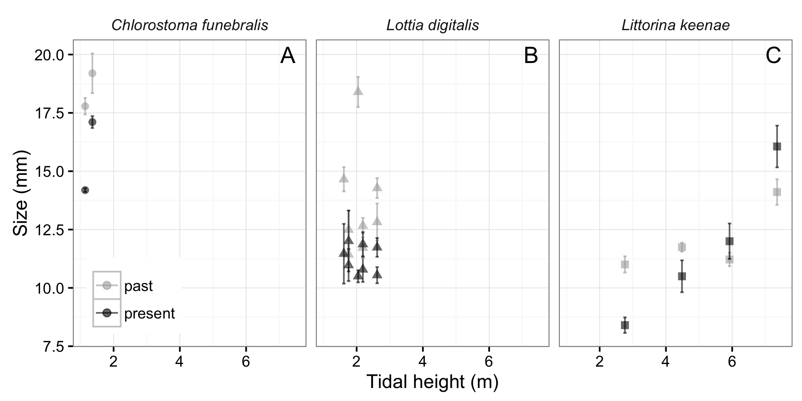

```{r setup, include = FALSE, cache = FALSE}
knitr::opts_chunk$set(echo = FALSE, message = FALSE, warning = FALSE, 
                      fig.path = 'figs/', cache.path = 'cache/graphics-', 
                      fig.align = 'center', fig.width = 5, fig.height = 5, 
                      fig.show = 'hold', cache = TRUE, par = TRUE)
knitr::opts_knit$set(root.dir = "../../")
```

```{r r_packages}
# tidyverse
library(dplyr); library(ggplot2); library(tidyr); library(readr)
theme_set(theme_bw(base_size = 12))

library(knitr)

```

# Tables {-}

We used a linear mixed-effects model (nlme package) to test the hypothesis that snail size frequency distributions differed between era (past vs present), and that this variation was mediated by tidal height. We treated sampling areas as random intercepts in the model. 

```{r aic1, echo = FALSE, eval = TRUE}
aic1 <- read.csv("output/AIC_eraXspeciesXtidalht.csv") %>% 
  select(-c(X, AIC, LL)) 
kable(aic1, caption = "Model selection results for linear mixed effects models testing the fixed effects of era, species, and tidal height on snail body size")
```

The model selection results suggest a strong interaction between all three predictors. In general, the peaks of the size frequency distributions have shifted to the left for all three species (Fig. 1), and thus mean snail body size is xx% smaller now than it was xx years ago. 

### Figures {-}





![Empirical rock and predicted body temperatures (mean +- CI of daily maximum, median, and minimum) quantified from 6-week deployments of temperature loggers in the gastropod sampling areas and predicted from heat budget models, respectively. Predictions are for a 30mm limpet (*Lottia gigantea*) from the same areas sampled for the three gastropods (*C. funebralis*, *L. digitalis*, *L. keenae*). The four black squares represent measurements from loggers placed in crevices where we sampled *L. keenae* (but not indicated for median and minimum temperatures for clarity). Note the different y-axes between panels. See Methods for details of measurements. ](../../figs/elahi_temp_body_rock.png)


