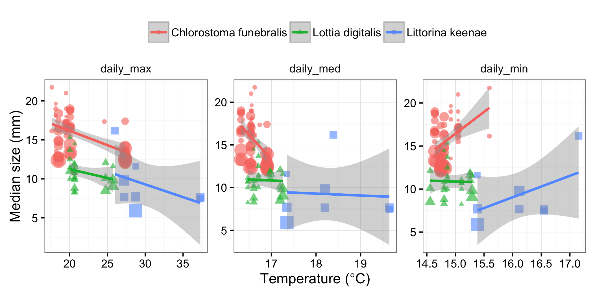

```{r setup, include = FALSE, cache = FALSE}
knitr::opts_chunk$set(echo = FALSE, message = FALSE, warning = FALSE, 
                      fig.path = 'figs/', cache.path = 'cache/graphics-', 
                      fig.align = 'center', fig.width = 5, fig.height = 5, 
                      fig.show = 'hold', cache = TRUE, par = TRUE)
knitr::opts_knit$set(root.dir = "../../")
```

```{r r_packages}
# tidyverse
library(dplyr); library(ggplot2); library(tidyr); library(readr)
theme_set(theme_bw(base_size = 12))

library(knitr)

```

# Figures {-}


![Empirical rock temperatures quantified from 6-week deployments of temperature loggers in the gastropod sampling areas (A), and predictions of body temperature from heat budget models {mean +- CI of daily maximum (red), median (green), and minimum (blue)}. Predictions are for a 30mm limpet (*Lottia gigantea*) from the same areas sampled for the three gastropods (*C. funebralis*, *L. digitalis*, *L. keenae*). The four black squares represent measurements from loggers placed in crevices where we sampled *L. keenae* (but not indicated for median and minimum temperatures for clarity). Black lines connect measurements from different sampling areas. Note the different y-axes between panels. See Methods for details of measurements. ](../../figs/elahi_temp_body_rock.png)

![Air temperatures (A) from a weather station in Monterey (36.6, -121.9; 2.44km south of the sampling sites; 117m above sea level), and seawater temperatures (B) from Hopkins Marine Station, Pacific Grove. Gray dashed lines and confidence intervals are plotted for time-series if the trend was significant (P < 0.05). In (A), the black lines represent time-series of predicted body temperatures for a sampling location low (1.1m above mean lower low water (mllw)) in the intertidal. In (B), the black lines represent time-series of predicted body temperatures for a sampling location high (7.6m above mllw) in the intertidal. Note that maximum air temperature coincides with predictions of body temperature high in the intertidal, but maximum seawater temperature coincides with predictions low in the intertidal. Gray symbols next to the x-axis represent the years during which snails were sampled.](../../figs/temp_timeseries.png)

