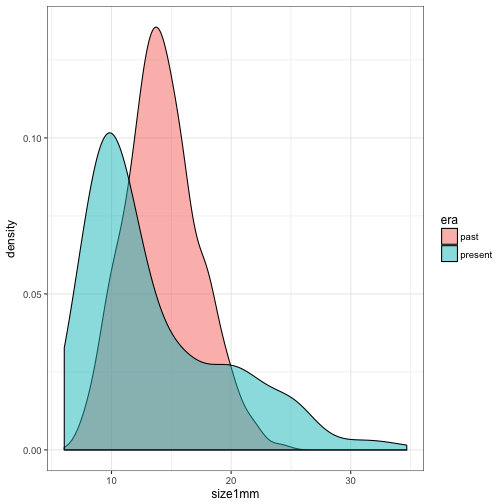
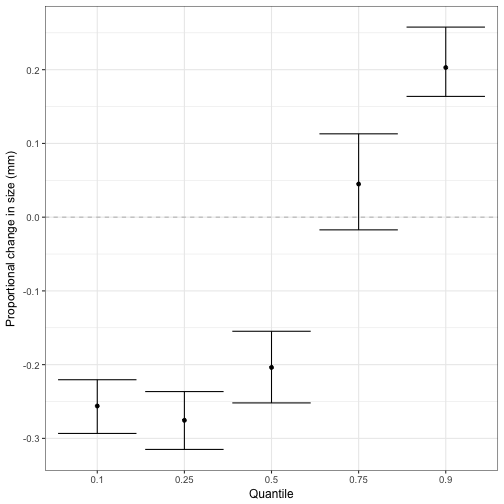

```r
## Robin Elahi
## 11 Sept 2017
## Trying to estimate changes in quantiles using JAGS

#rm(list = ls())

library(broom)
library(dplyr)
library(tidyr)
library(ggplot2)

##### SIMULATE DATA #####
## 
past_mu <- 14
present_mu <- 10
past_sigma <- 1.25
present_sigma <- 1.25
pastN <- 300
presentN <- 200

## Add individuals that are larger than the past mean
present_mu2 <- 20
present_sigma2 <- 1.25
presentN2 <- 100

set.seed(151)
past <- rlnorm(pastN, log(past_mu), log(past_sigma))
present <- rlnorm(presentN, log(present_mu), log(present_sigma))
present2 <- rlnorm(presentN2, log(present_mu2), log(present_sigma2))
present <- c(present, present2)

dat <- data.frame(past = past, present = present) %>% tbl_df() %>% 
  gather(key = era, value = size1mm) %>% 
  mutate(eraJ = ifelse(era == "past", 0, 1))

dat %>% 
  ggplot(aes(size1mm, fill = era)) + geom_density(alpha = 0.5)
```



```r
dat %>%
  group_by(era) %>%
  do(tidy(t(quantile(.$size1mm)))) %>% ungroup()
```

```
## # A tibble: 2 × 6
##       era      X0.      X25.     X50.     X75.    X100.
##     <chr>    <dbl>     <dbl>    <dbl>    <dbl>    <dbl>
## 1    past 7.376661 12.253328 14.02992 16.11318 24.11644
## 2 present 6.048531  9.311228 11.44127 16.86612 34.68350
```

```r
dat %>% group_by(era) %>% summarise(mean(size1mm))
```

```
## # A tibble: 2 × 2
##       era `mean(size1mm)`
##     <chr>           <dbl>
## 1    past        14.25261
## 2 present        13.57348
```

```r
##### SET UP MODEL FOR QUANTILE MODELS #####

# load jags
library(rjags)

inits = list(
  list(
    alpha = runif(1, 0, 5), 
    beta = runif(1, -10, 10), 
    sigma = 1), 
  list(
    alpha = runif(1, 0, 5), 
    beta = runif(1, -10, 10), 
    sigma = 1))


## JAGS model
#sink("sbs_bayes/models/model_normal_quantile.R")
cat(" 
    model{
    # priors
    alpha ~ dnorm(0, 1/5^2) 
    beta ~ dnorm(0, 1/10^2)
    sigma ~ dunif(0, 100)
    tau <- 1/sigma^2
    
    # likelihood
    for (i in 1:k){
    mu[i] <- alpha + beta * era[i]
    
    w[i]  ~ dexp(tau) # exponential distribution
    me[i] <- (1 - 2 * p) / (p * (1 - p)) * w[i] + mu[i] # if p = 0.5, then this just leaves mu[i]
    pe[i] <- (p * (1 - p) * tau) / (2 * w[i]) # 
    #y[i]  ~ dnorm(me[i], pe[i])
    
    y[i] ~ dnorm(me[i], pe[i])
    
    y.new[i] ~ dnorm(me[i], pe[i])
    sq.error.data[i] <- (y[i] - mu[i])^2
    sq.error.new[i] <- (y.new[i] - mu[i])^2
    }
    
    # bayesian p-values
    sd.data <- sd(y)
    sd.new <- sd(y.new)
    p.sd <- step(sd.new - sd.data)
    
    mean.data <- mean(y)
    mean.new  <- mean(y.new)
    p.mean <- step(mean.new - mean.data)
    
    }
    ", fill = TRUE)
```

```
##  
##     model{
##     # priors
##     alpha ~ dnorm(0, 1/5^2) 
##     beta ~ dnorm(0, 1/10^2)
##     sigma ~ dunif(0, 100)
##     tau <- 1/sigma^2
##     
##     # likelihood
##     for (i in 1:k){
##     mu[i] <- alpha + beta * era[i]
##     
##     w[i]  ~ dexp(tau) # exponential distribution
##     me[i] <- (1 - 2 * p) / (p * (1 - p)) * w[i] + mu[i] # if p = 0.5, then this just leaves mu[i]
##     pe[i] <- (p * (1 - p) * tau) / (2 * w[i]) # 
##     #y[i]  ~ dnorm(me[i], pe[i])
##     
##     y[i] ~ dnorm(me[i], pe[i])
##     
##     y.new[i] ~ dnorm(me[i], pe[i])
##     sq.error.data[i] <- (y[i] - mu[i])^2
##     sq.error.new[i] <- (y.new[i] - mu[i])^2
##     }
##     
##     # bayesian p-values
##     sd.data <- sd(y)
##     sd.new <- sd(y.new)
##     p.sd <- step(sd.new - sd.data)
##     
##     mean.data <- mean(y)
##     mean.new  <- mean(y.new)
##     p.mean <- step(mean.new - mean.data)
##     
##     }
## 
```

```r
#sink()

##### SET UP DATA FOR QUANTILE MODELS #####
## Iterations
n.adapt = 1000
n.update = 1000
n.iter = 1000

my_p = 0.5
p_vector = c(0.1, 0.25, 0.5, 0.75, 0.9)
coda_list <- list()

i = 3
# 
# for(i in 1:length(p_vector)){
#   
#   my_p = p_vector[i]
#   
#   ## Data
#   data = list(
#     y = as.double(log(dat$size1mm)),
#     era = as.double(dat$eraJ), 
#     k = as.double(length(dat$size1mm)), 
#     p = as.double(my_p)
#   )
#   
#   jm = jags.model("sbs_bayes/models/model_normal_quantile.R", data = data, inits = inits, 
#                   n.chains = length(inits), n.adapt = n.adapt)
#   update(jm, n.iter = n.update)
#   zm = coda.samples(jm, variable.names = c("alpha", "beta", "sigma", "p.mean"), 
#                     n.iter = n.iter, n.thin = 1)
#   zj = jags.samples(jm, variable.names = c("alpha", "beta", "sigma", "y.new", "p.mean", "p.sd"), 
#                     n.iter = n.iter, n.thin = 1)
#   
#   # Test for convergence using the Gelman diagnostic.
#   gd <- gelman.diag(zm, multivariate = F)[[1]]
#   
#   # Check Bayesian pvals
#   pvals <- c(p.mean = mean(zj$p.mean), p.sd = mean(zj$p.sd))
#   
#   # alpha_quantiles <- summary(zj$alpha, quantile, c(0.025, 0.5, 0.975))$stat
#   # beta_quantiles <- summary(zj$beta, quantile, c(0.025, 0.5, 0.975))$stat
#   # sigma_quantiles <- summary(zj$sigma, quantile, c(0.025, 0.5, 0.975))$stat
#   # zj_quantiles <- data.frame(alpha = alpha_quantiles, 
#   #                            beta = beta_quantiles, 
#   #                            sigma = sigma_quantiles)
#   # zj_quantiles$quant <- rownames(zj_quantiles)
#   
#   # Save coda summary
#   coda_summary <- summary(zm)
#   summary_name <- paste("quantile", my_p, sep = "_")
#   coda_quantile <- data.frame(coda_summary$quantile) %>% 
#     mutate(coda_quantile = summary_name, 
#            param = rownames(coda_summary$quantile))
#   
#   # Create list of all desired objects
#   coda_list.i <- list(coda_quantile, gd, pvals)
#   coda_list[[i]] <- coda_list.i
#   
# }

# Compared observed vs simulated
# hist(log(dat$size1mm), breaks = 20, freq=FALSE, ylim = c(0,2)) 
# lines(density(zj$y.new), col="red")


# Rbind results
# coda_df <- coda_list[[1]][[1]]
# for(i in 2:length(p_vector)){
#   coda_df <- rbind(coda_df, coda_list[[i]][[1]])
# }
# 
# cc       <- strsplit(coda_df$coda_quantile, split = "_")
# part1    <- unlist(cc)[2*(1:length(coda_df$coda_quantile))-1]
# part2    <- unlist(cc)[2*(1:length(coda_df$coda_quantile))  ]
# coda_df <- coda_df %>% mutate(quant = part2)
# 
# write.csv(coda_df, "sbs_bayes/bayes_output/coda_quantile_df.csv")

##### PLOT BETAS #####

coda_df <- read.csv("sbs_bayes/bayes_output/coda_quantile_df.csv")
```

```
## Warning in file(file, "rt"): cannot open file 'sbs_bayes/bayes_output/
## coda_quantile_df.csv': No such file or directory
```

```
## Error in file(file, "rt"): cannot open the connection
```

```r
coda_df %>% 
  filter(param == "beta") %>% 
  ggplot(aes(quant, X50.)) + 
  geom_point() + 
  geom_errorbar(aes(ymin = X2.5., ymax = X97.5.)) + 
  geom_hline(yintercept = 0, linetype = "dashed", color = "gray") + 
  ylab("Proportional change in size (mm)") + 
  xlab("Quantile")
```



```r
ggsave("sbs_bayes/bayes_figs/coda_df_quantiles.png", height = 3.5, width = 3.5)
```

```
## Error in grDevices::dev.off(): QuartzBitmap_Output - unable to open file 'sbs_bayes/bayes_figs/coda_df_quantiles.png'
```

